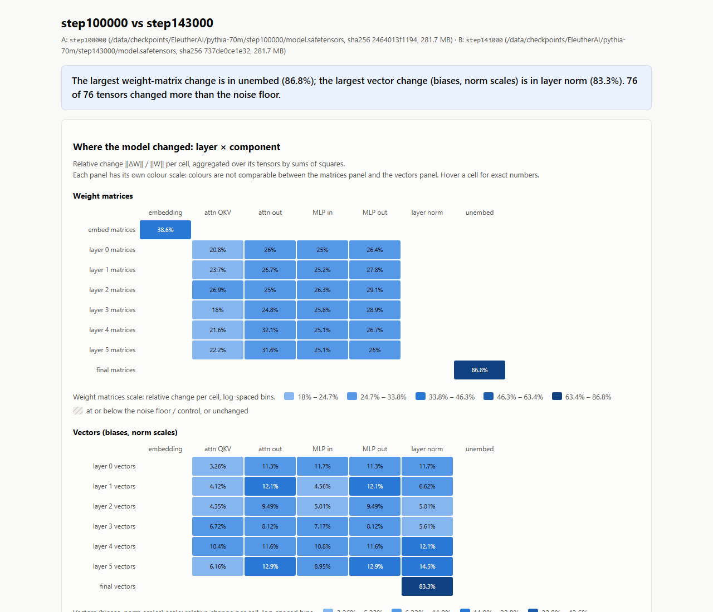

# Example: one real diff

Pythia-70M at training step 100000 against step 143000, the final step. Everything below is
from a real run on 2026-09-22 (Windows, PowerShell, Docker Desktop, CPU only). Nothing is
made up or edited except where marked.

## The command

Both checkpoints were already in the store from an earlier `trajectory` run, so they are
passed here by their local paths inside the container. The same pair from the Hub would be
`EleutherAI/pythia-70m@step100000 EleutherAI/pythia-70m@step143000`: on a fresh machine it downloads 2 × 281.7 MB
and then gives the same numbers.

```powershell
docker compose run --rm te diff `
    /data/checkpoints/EleutherAI/pythia-70m/step100000 `
    /data/checkpoints/EleutherAI/pythia-70m/step143000 `
    -o /data/reports/example_step100000_vs_step143000.html -v
```

Output (the cache file name is shortened by hand):

```
INFO trajectory_explorer.diff: Metrics cache hit: 2464013f1194..._737de0ce1e32..._m2.json
Report: /data/reports/example_step100000_vs_step143000.html (on the host: D:/trajectory-explorer-data/reports/example_step100000_vs_step143000.html)
The largest weight-matrix change is in unembed (86.8%); the largest vector change (biases, norm scales) is in layer norm (83.3%). 76 of 76 tensors changed more than the noise floor.
```

Exit code 0, 10.5 s wall time including container start. The trajectory had already measured
this pair, so the numbers came from the metrics cache and no weights were loaded, apart from
hashing the two local files. Measuring this pair from scratch took 20.1 s in that trajectory
run.

## The report at a glance



The screenshot is the top of the report at 1280 px wide, in light mode. From the top:

- **Title and sources**: both files, with their paths, sha256 prefixes and sizes (281.7 MB each).
- **Banner**: the one-sentence summary printed above.
- **Weight matrices panel**: one row per layer, one column per component. Every cell is blue,
  meaning above the noise floor. The unembedding (86.8%) is the darkest cell and the embedding
  (38.6%) the next largest. The attention and MLP matrices in layers 0 to 5 moved by 18% to 32%.
- **Vectors panel** (biases and norm scales), on its own colour scale: mostly 3% to 15%. The
  final layer norm, at 83.3%, is the darkest.

Further down, not in the screenshot:

- **"What moved most"**: two tables. For matrices, the top three are `embed_out.weight` (86.8%,
  effective rank 222 of 512, r90 1, dense, spread), `gpt_neox.embed_in.weight` (38.6%, effective
  rank 506 of 512, r90 439) and `gpt_neox.layers.4.attention.dense.weight` (32.1%). For vectors,
  the top three are `gpt_neox.final_layer_norm.bias` (151%), `gpt_neox.final_layer_norm.weight`
  (65%) and `gpt_neox.layers.4.input_layernorm.bias` (49.4%).
- **Noise floor**: all 76 tensors are stored as float32 but hold only float16 values, so the
  float16 floor applies: 1.20e-03 (0.12%). All 76 are above it, and no control pair was given.
- **What the labels mean**: the effective rank, r90 and label definitions.

The unembedding row is a good example of why the report shows effective rank and r90 side by
side: one direction holds 90% of the change's energy (r90 = 1), yet the entropy-based effective
rank is 222 of 512. See [docs/metrics.md](../docs/metrics.md#effective-rank-and-r90-matrices-only).

The step100000 → step143000 interval is 43,000 training steps long. A large change here is
spread over many more steps than in the early, short intervals of a trajectory.
